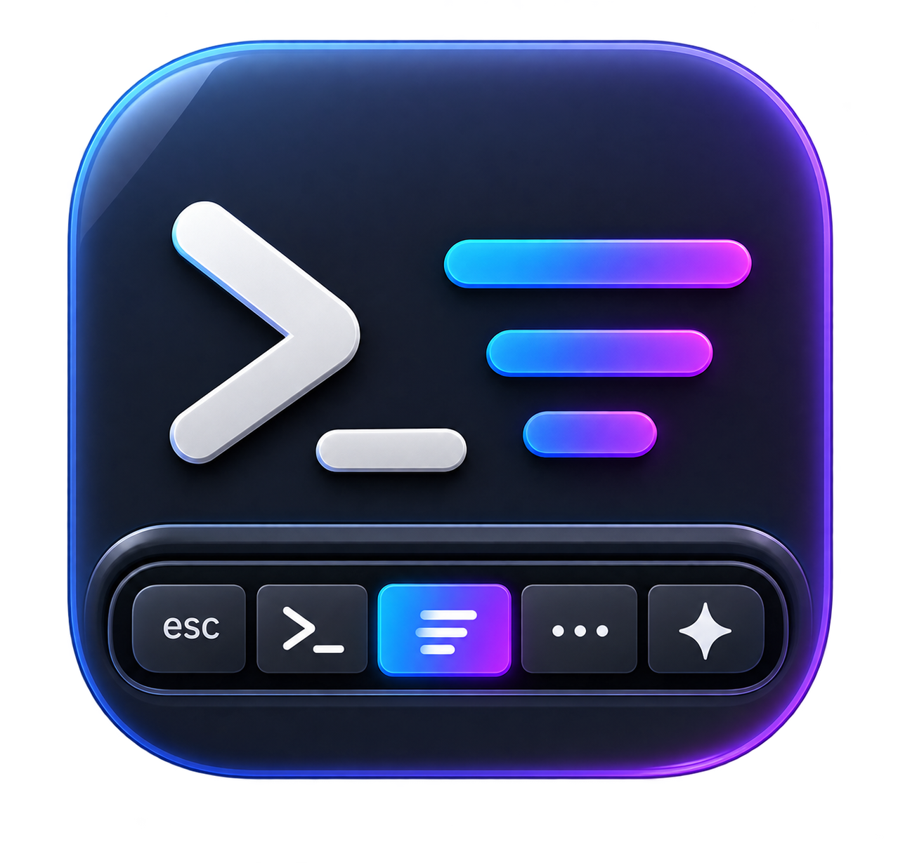

<p align="center">
  
</p>

<h1 align="center">OpenCode Usage TouchBar</h1>

<p align="center">See your remaining Codex and OpenCode Go usage in the macOS menu bar and Touch Bar.</p>

<p align="center"><a href="CHANGELOG.md">Changelog</a> · <a href="CONTRIBUTING.md">Contributing</a></p>

> [!IMPORTANT]
> This is an unofficial community project. It is not affiliated with, sponsored by, or endorsed by OpenAI or OpenCode. The local Codex app-server interface and persistent Touch Bar behavior may change without notice.

> [!NOTE]
> This project is a rename and continuation of the original
> [Codex Usage Bar](https://github.com/yizhigou/codex-usage-bar). The app still
> displays Codex rate limits as before, with the OpenCode Go usage tracking
> baked in and the project renamed to `opencode-usage-touchbar`.

## Features

- Shows five-hour and weekly remaining Codex usage in the menu bar.
- Uses a native macOS menu for progress, reset times, credits, and resets.
- Configurable menu bar icon, icon size, and text size.
- Follows the system language by default, with in-app switching between Simplified Chinese, Traditional Chinese, English, Japanese, Korean, and Spanish.
- Optional launch at login and automatic refresh every five minutes.
- Touch Bar progress, percentages, and manual refresh.
- Animated Codex pet on the Touch Bar, loaded from pets installed under
  `~/.codex/pets/` (compatible with [codexpet.top](https://codexpet.top)), with
  an adjustable state-change interval (default 30–90 s) in Settings.
- Optional automatic Touch Bar presentation while Codex is frontmost.
- Optional OpenCode Go usage (rolling, weekly, and monthly) in the menu bar, menu, and Touch Bar.
- No third-party dependencies.

## Requirements

- macOS 14.0 or later.
- Codex desktop installed and signed in, or a compatible `codex` executable in a common installation path.
- OpenCode Go display is optional and needs your OpenCode Go API key (see below).
- Touch Bar features require a Touch Bar-equipped MacBook Pro. The menu bar works on other Macs.

## OpenCode Go usage

OpenCode Go usage is shown when an API key is available. Enter your OpenCode
Go API key in the app's Settings — it is stored securely in the macOS Keychain
and used to call the read-only OpenCode Go usage endpoint
(`https://opencode.ai/zen/go/v1/usage`). The menu bar, menu, and Touch Bar
then show the rolling (5-hour), weekly, and monthly remaining usage. Use
"Remove Key" in Settings to delete the stored key.

As an alternative, the app process can provide the key through the
`OPENCODE_GO_API_KEY` environment variable (for example when launching from a
terminal):

```bash
OPENCODE_GO_API_KEY="opencode-..." open "dist/OpenCode Usage TouchBar.app"
```

A key stored in the Keychain takes precedence over the environment variable.
Without any key, the menu shows a hint and Codex-only usage.

## Codex pet on the Touch Bar

Install any pet from [codexpet.top](https://codexpet.top) with their official
installer (it places `pet.json` and `spritesheet.webp` under
`~/.codex/pets/<pet-id>/`), then open the app's Settings → Pet and pick it.
The pet idles on the Touch Bar, occasionally changes state on its own, and
waves when tapped. It is purely decorative: it never reads Codex task state
and does not trigger any network request. A custom pets folder can be chosen
in Settings instead of the default `~/.codex/pets/`.

## Install

### GitHub Release

1. Download the latest `opencode-usage-touchbar-v*.zip`.
2. Extract it and move `OpenCode Usage TouchBar.app` to `/Applications`.
3. If Gatekeeper blocks the first launch, review and allow it in System Settings → Privacy & Security.

Community builds without Developer ID signing and notarization may display additional security warnings. Only run builds you trust.

### Build from source

```bash
git clone https://github.com/yizhigou/codex-usage-bar.git
cd codex-usage-bar
./build-app.sh dist
open "dist/OpenCode Usage TouchBar.app"
```

The default build is universal (`arm64` and `x86_64`). To build only for the current architecture:

```bash
CODEX_USAGE_ARCHS="$(uname -m)" ./build-app.sh dist
```

## How it works

The app launches the locally installed:

```text
codex app-server --stdio
```

and sends the read-only `account/rateLimits/read` request. It does not read or store cookies, access tokens, or conversation content, and contains no telemetry or third-party analytics. When OpenCode Go is configured, the app also sends one read-only request to the OpenCode Go usage endpoint with the environment-provided key.

See [docs/PRIVACY.md](docs/PRIVACY.md) and [docs/ARCHITECTURE.md](docs/ARCHITECTURE.md).

## Touch Bar compatibility

Normal content uses public `NSTouchBar` APIs. Automatic presentation while Codex is frontmost uses undocumented AppKit system-modal selectors after checking for them at runtime. Therefore it cannot be distributed through the Mac App Store and may stop working after a macOS update. The menu bar remains functional when the selector is unavailable.

See [docs/TOUCH_BAR.md](docs/TOUCH_BAR.md).

## Development and release

```bash
swift build
./build-app.sh dist
./scripts/release.sh
```

The build script uses ad-hoc signing by default. For public Developer ID builds:

```bash
CODE_SIGN_IDENTITY="Developer ID Application: Example (TEAMID)" \
  ./scripts/release.sh
```

Keep certificates, passwords, and notarization credentials out of the repository.

## License and trademarks

Source code and original project assets are available under the [MIT License](LICENSE). See [NOTICE.md](NOTICE.md) for the unofficial-project and trademark notice.